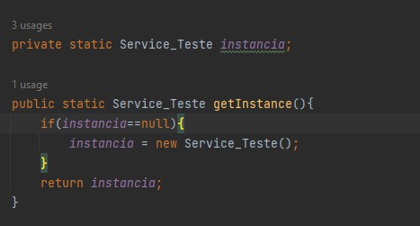
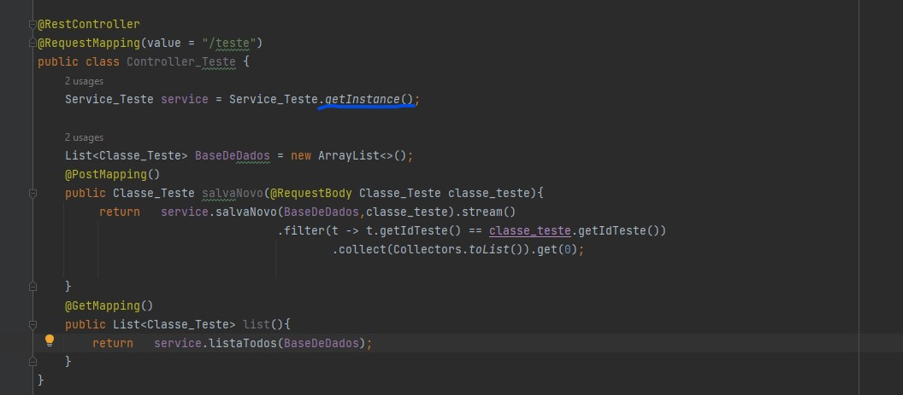

# ShowCaseSingleton
<b>Este é um repositório voltado a teste de implementação na pratica do 
Design pattern Singleton
 
*Aplicação feita em Java11
 
 
 
<b>Nesta aplicação existem dois metodos.
Um GET e um POST.
Abaixo seus curl para importar no cliente da sua preferencia, Insomnia , postman, etc.  
Você pode subir e testar a aplicação como preferir
</b>
###### POST
``
curl --location --request POST 'http://localhost:8080/teste' \
--header 'Content-Type: application/json' \
--data-raw '{
"idTeste":3,
"nomeTeste":"nome3"
}'
``
###### GET
``
curl --location --request GET 'http://localhost:8080/teste' \
--header 'Content-Type: application/json' \
--data-raw '{
"idTeste":1,
"nomeTeste":"nome1"
}'
``

O design Pattern Singleton tem uma usabilidade voltada para melhorar desempenho.  
Economia e melhor gerenciamento de memória e processamento.  
E ele faz isso através de uma estratégia simples.    

Ele faz com que sua aplicação tenha somente uma unica instancia de sua classe aonde 
vc o aplicar.  
Ele pode ser usado em camadas de transferencias de dados(@Component) ou em camadas de
  servico (@Service) e até mesmo em camadas de persistencia de dados (@Repository).  
 
A estratégia se trata de criar um construtor privado para gerar uma "Instancia".  
E através dela você faz a chamada de sua classe.  
Dai então toda a vez que aquela classe for chamada, ela sempre estará usando a mesma instancia.  
Isso é usado para tirar do container/kubernates a responsabilidade de gerenciar as instancias 
que seriam criadas pelas notações @Service, @Component ou @repository.
 
 
Abaixo exemplo do código  
### Camada de serviço:
  

### Chamada no Controller:
  

O comportamento natural de uma notação spring, @Service, @Repository, @component   
é de abrir uma nova instancia de execução da classe toda vez que essa for chamada.  
E o sistema operacional da maquina tende a fazer o gerenciamento da memória e aplicação baseado nisso.  
No caso dos sistemas atuais virtualizados, o Docker ou Kubernates.  

Deve-se cogitar o uso desse pattern quando se identificar dificuldade de processamento ou picos de consumo de processamento  
ou memória em determinados processos da execução de seu sistema.

